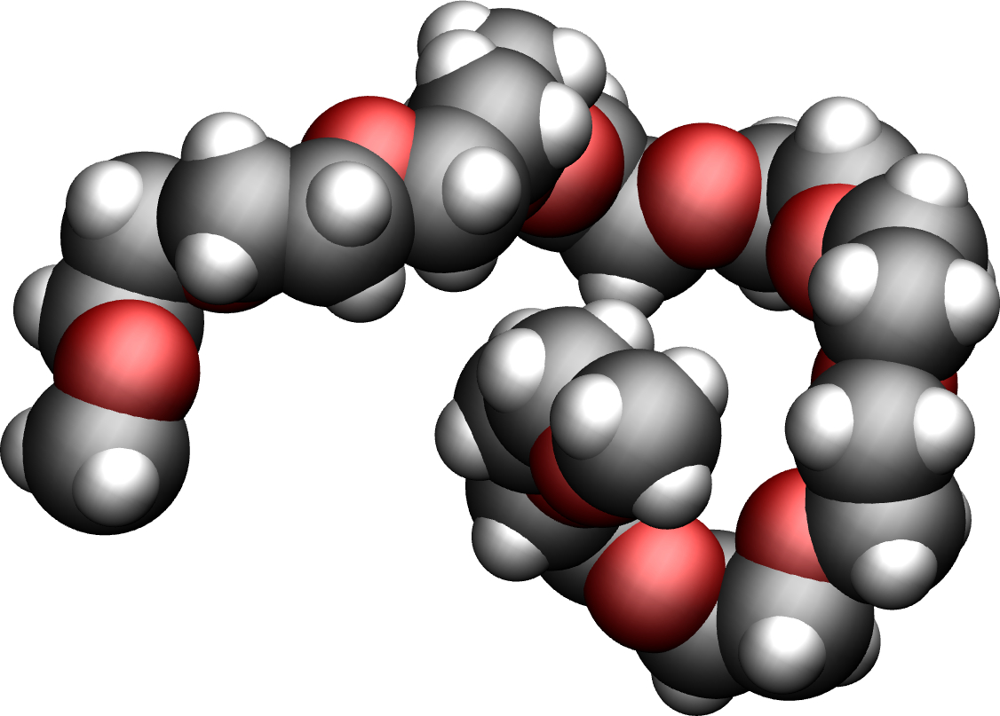

# PEG in vacuum

The ssytem is a small PEG molecule in vacuum (or rather implicit water).



## How to

Run gromacs using  

```
gmx grompp -f inputs/nvt.mdp -c peg.gro -p topol.top -o nvt -maxwarn 1
gmx mdrun -v -deffnm nvt
```

### Output

This [video](https://youtu.be/8ldIHP175TI) has been made with this script.

### Contact

Feel free to contact me by email if you have inquiries. You can find contact details on my [personal page](https://simongravelle.github.io/).


