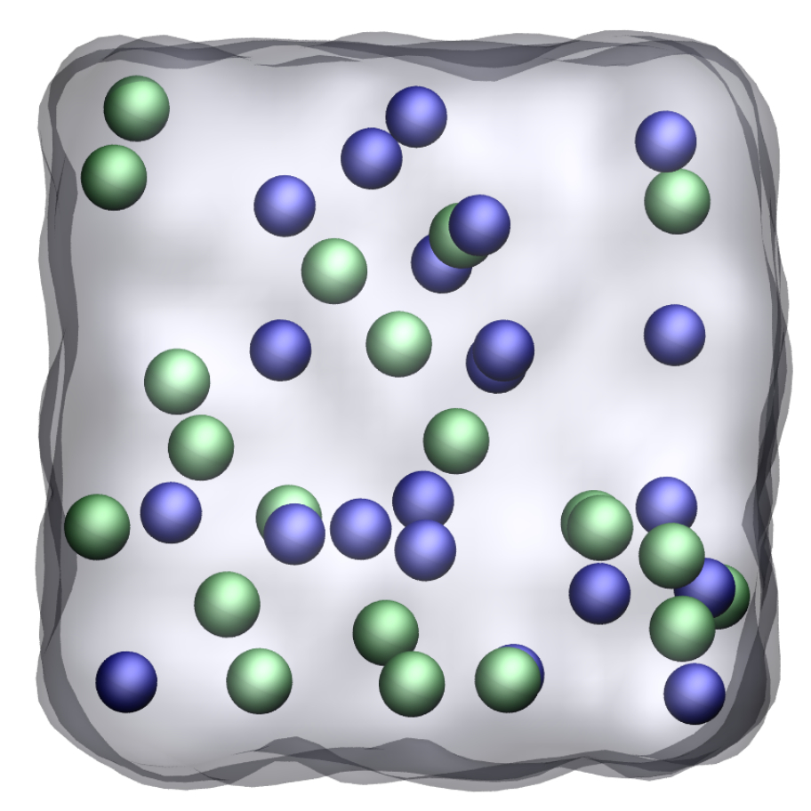

# Bulk sodium chloride solution



### Description

The simulation consists in a cubic box filled with water molecule and 
Na Cl ions. The force field for the water is [tip4p/epsilon](https://doi.org/10.1021/jp410865y). The force field for the ions is from [Loche et al.](https://doi.org/10.1021/acs.jpcb.1c05303)

### How to

Execute generate_configuration_gromacs.ipynb using jupyter-notebook to generate 
the initial configuration, or use the build_multiple_folder.sh bash script.

Then, run gromacs using
```
gmx grompp -f ../input/nvt.mdp -o nvt -pp nvt -po nvt
gmx mdrun -v -deffnm nvt
mv nvt.gro conf.gro

gmx grompp -f ../input/npt.mdp -o npt -pp npt -po npt
gmx mdrun -v -deffnm npt
mv npt.gro conf.gro

gmx grompp -f ../input/prod.mdp -o prod -pp prod -po prod
gmx mdrun -v -deffnm prod
```

### Contact

Feel free to contact me by email if you have inquiries. You can find contact 
details on my [personal page](https://simongravelle.github.io/).
