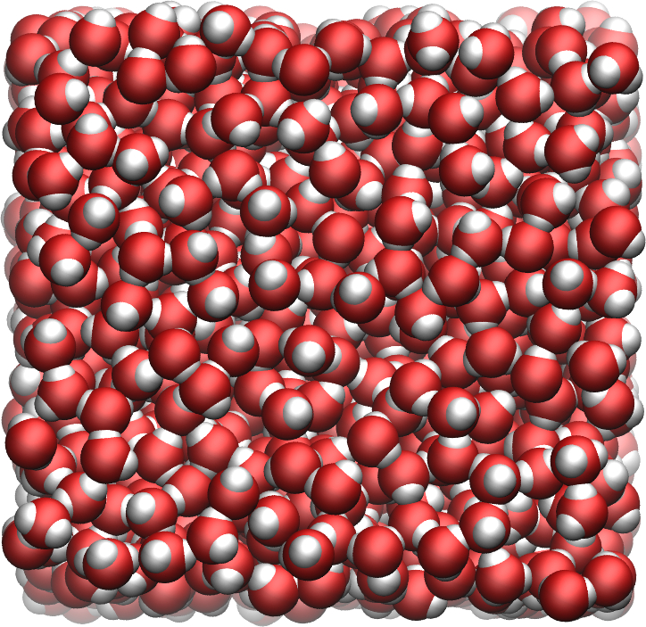

# Diffusion coefficient of bulk water

The simulation consists in a cubic box filled with water molecule.
The force field for the water is [tip4p/epsilon](https://doi.org/10.1021/jp410865y). 



## How to

Run gromacs using  

```
gmx grompp -f Input/equil.mdp -o equil -pp equil -po equil
gmx mdrun -ntomp ${NSLOTS} -v -deffnm equil
mv equil.gro conf.gro

gmx grompp -f Input/run.mdp -o run -pp run -po run
gmx mdrun -ntomp ${NSLOTS} -v -deffnm run
```

## Diffusion coefficient measurement

### Method 1 - using GROMACS

Execute the following command in the terminal:
```
gmx msd -f run.xtc -s run.tpr
```

### Method 2 - using MDAnalysis

Convert the trajectory to remove the periodic boundary conditions using:
```
gmx trjconv -f run.xtc -o trajectory.xtc -pbc nojump
```

Using python, run

```
python DiffusionCoefficientMDA.py
```

### Contact

Feel free to contact me by email if you have inquiries. You can find contact details on my [personal page](https://simongravelle.github.io/).


